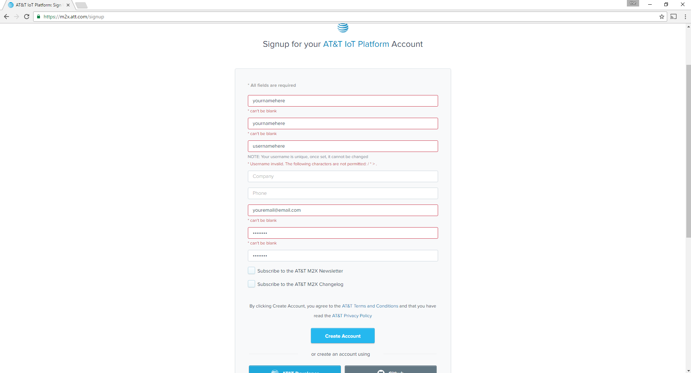
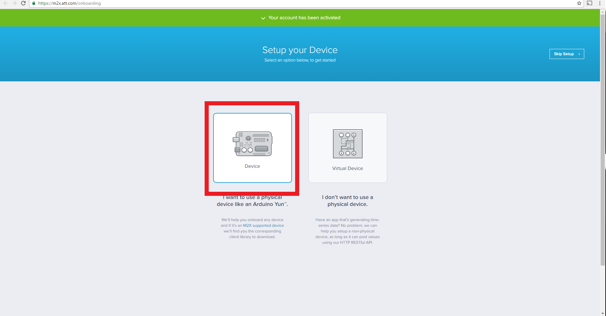
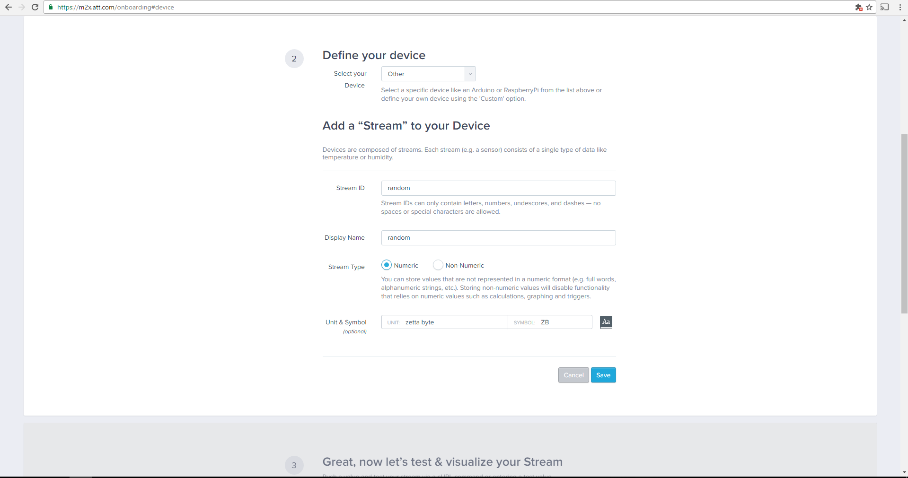
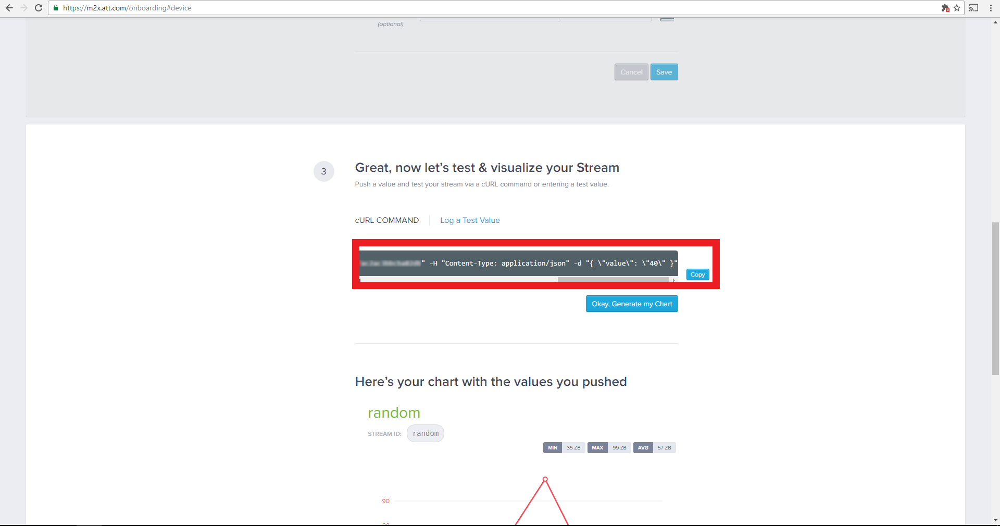
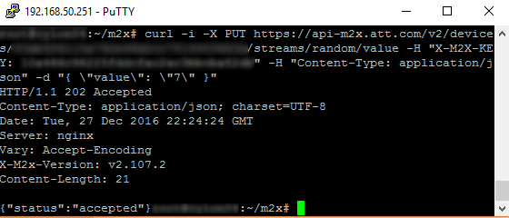
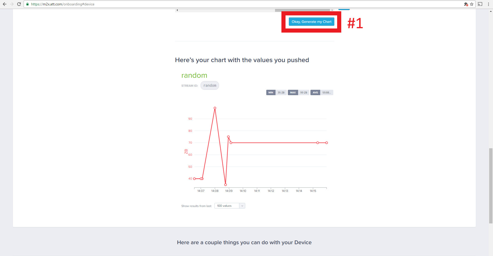
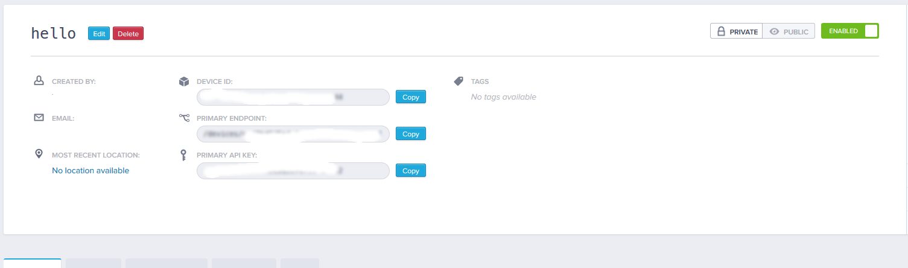

# Connecting to AT&T M2X IoT using MQTT

## M2X IoT initial setup

1. Create an account on https://m2x.att.com, if you do not yet have one.


2. Fill out your information when signing up.


3. Verify your email address by clicking the link in the email recieved by AT&T. (Be sure to check your spam folder, the verification is requred to continue.)


4. Select the "Select Device" button.


5. Define your device. Select "other" in the select your device dropdown box. Then continue to define your device.


## Testing your device

1. Copy the cURL command and click the "generate my chart" button.


2. Paste the cURL command into your command line interface connected to your device and run the command.


You should now see a chart with the information you entered via the curl command on the new chart.


When you now log into AT&T M2X platform you will now be able to view all of your device information.


## Summary

If you have followed all the steps above, you should have all the information that your program needs to connect to the MQTT\* server:

- `MQTT_SERVER` - use `<M2X Primary API Key>@api-m2x.att.com`, along with the `ssl://` (for C++) or the `mqtts://` (for JavaScript\*) protocol

- `MQTT_CLIENTID` - use `<M2X Device ID>`

- `MQTT_TOPIC` - use `m2x/<M2X Primary API Key>/requests`

- `MQTT_USERNAME` - use `<M2X Device ID>`

- `MQTT_PASSWORD` - leave blank.

- `MQTT_SERVICE` - set to `m2x`.

- `API_KEY` - set to `<M2X Primary API Key>`.

- `DEVICE_ID` - set to `<M2X Device ID>`.

- `STREAM_ID` - set to `<M2X Stream ID>`.

## Additional setup for C++

When running your C++ code on the Intel® Edison board or Intel® IoT Gateway, you need to set the MQTT\* client parameters in Intel® System Studio\*. To do that:

1. Go to **Run configurations** and, in the **Commands to execute before application** field, type the following:

        chmod 755 /tmp/<Your app name>; export MQTT_SERVER="ssl://<M2X Primary API Key>@api-m2x.att.com:8883"; export MQTT_CLIENTID="<M2X Device ID>"; export MQTT_USERNAME="<M2X Device ID>"; export MQTT_SERVICE="m2x"; export API_KEY="<M2X Primary API Key>"; export DEVICE_ID="<M2X Device ID>"; export STREAM_ID="<M2X Stream ID>"; export MQTT_TOPIC="m2x/<M2X Primary API Key>/requests"

2. Click the **Apply** button to save these settings.
3. Click the **Run** button to run the code on your board.

## Additional setup for JavaScript\*

When running your JavaScript\* code on the Intel® Edison board or Intel® IoT Gateway, you need to set the MQTT\* client parameters in the Intel® XDK IDE. Add the following entries to the **config.json** file:

```json
{
 "MQTT_SERVER": "mqtts://<M2X Primary API Key>@api-m2x.att.com",
 "MQTT_CLIENTID": "<M2X Device ID>",
 "MQTT_USERNAME": "<M2X Device ID>",
 "MQTT_PASSWORD": "",
 "MQTT_TOPIC": "m2x/<M2X Primary API Key>/requests",
 "MQTT_SERVICE": {
    "NAME": "m2x",
    "API_KEY": "<M2X Primary API Key>",
    "DEVICE_ID": "<M2X Device ID>",
    "STREAM_ID": "<M2X Stream ID>"
  }
}
```

## Additional setup for Python\*

When running your Python\* code on the Intel® Edison board or Intel® IoT Gateway, you need to set the MQTT\* client parameters on the board itself. Add the following entries to the **config.json** file:

```json
{
 "MQTT_SERVER": "ssl://<M2X Primary API Key>@api-m2x.att.com",
 "MQTT_CLIENTID": "<M2X Device ID>",
 "MQTT_USERNAME": "<M2X Device ID>",
 "MQTT_PASSWORD": "",
 "MQTT_TOPIC": "m2x/<M2X Primary API Key>/requests",
 "MQTT_SERVICE": {
    "NAME": "m2x",
    "API_KEY": "<M2X Primary API Key>",
    "DEVICE_ID": "<M2X Device ID>",
    "STREAM_ID": "<M2X Stream ID>"
  }
}
```
