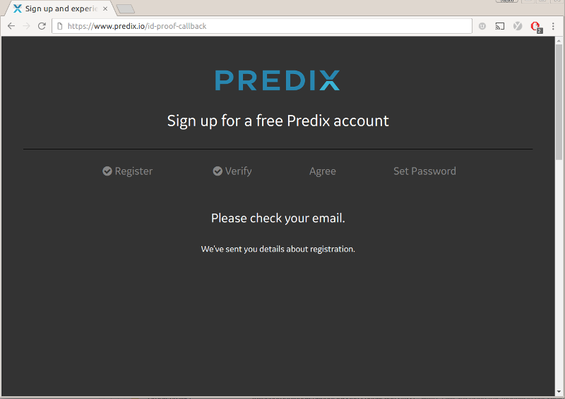
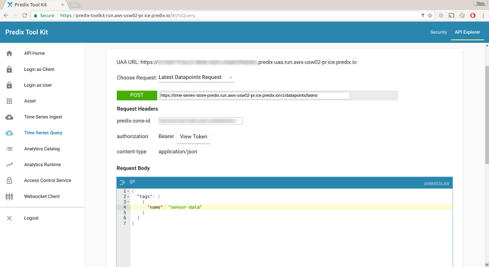

# Connecting to GE\* Predix\* IoT

To get started using GE\* Predix\* IoT (https://www.predix.io/), you must first setup your development machine. These instructions follow the "Development machine configurations and step-by-step to building Predix Application and Services" steps listed at https://github.com/PredixDev/predix-scripts#development-machine-configurations-and-step-by-step-to-building-predix-application-and-services

## Register for a Predix\* account

First, signup for a Predix\* Developer account.

Follow the [registration instructions](https://docs.predix.io/en-US/content/platform/get_started/get_started_for_predix_developers/predix-development-environment-setup#task_a0b9d32e-24ff-4c84-a210-713527bce17c).

If you already have an account, you can skip to the next step.



## Install the Cloud Foundry\* Command Line Tool

Now, install the Cloud Foundry\* Command Line Tool.

Follow the installation instructions from the [Cloud Foundry Downloads](https://github.com/cloudfoundry/cli#downloads).

If you already have installed it, you can skip to the next step.

## Predix\* setup

1. Clone the predix-scripts repository

Use git to clone the Predix\* repository that contains the setup scripts, as follows:

```
git clone https://github.com/PredixDev/predix-scripts.git
cd predix-scripts
```

2. Edit the variables file

Use your text editor to open and modify the file `/bash/scripts/variables.sh` to enter your account's UAA configuration data for the following values:

```
# The username of the new user to authenticate with the application
UAA_USER_NAME="<enter your user name, same as your email>"

# The email address of username above
UAA_USER_EMAIL="<enter your email>"

# The password of the user above
UAA_USER_PASSWORD="<enter your password>"

# The secret of the Admin client ID (Administrator Credentails)
UAA_ADMIN_SECRET="<choose a password>"

# The generic client ID that will be created with necessary UAA scope/autherities
UAA_CLIENTID_GENERIC="<choose a client id>"

# The generic client ID password
UAA_CLIENTID_GENERIC_SECRET="<choose a password>"
```

For UAA_USER_NAME, UAA_USER_EMAIL, and UAA_USER_PASSWORD you must enter the same values that match those for your Predix account.

Note that for UAA_ADMIN_SECRET, UAA_CLIENTID_GENERIC, and UAA_CLIENTID_GENERIC_SECRET you should enter values of your own choosing, since those accounts will be created as part of provisioning your new app.

3. Create application and services

Now you are ready to run the script that creates your Predix\* application and all needed services. Run the following command:

```
./bash/quickstart.sh -cs
```

Once the script is done, it will have created the application in the Predix\* cloud, and deployed all needed service. You can now obtain all of the information you need to connect your device to the Predix\* service, by looking in the `bash/log/predix-services-summary.txt` file.

## Summary

If you have followed all the steps above, you should now have all the information that your program needs to connect to Predix\*:

`uaa_client_id` - The UAA Client ID for your account

`uaa_client_secret` - The UAA client secret

`uaa_url` - Which UAA URL to use

`timeseries_zone_id` - timeseries zone id

`timeseries_ingest_url` - timeseries ingestion url

## Additional setup for C++

When running your C++ code on the Intel® Edison board or Intel® IoT Gateway, you will need to use the WebSockets client interface by setting the correct parameters in Eclipse\*. To do that:

1. Go to **Run configurations** and, in the **Commands to execute before application** field, type the following:

      export PREDIX_UAA_CLIENT_ID="[uaa client id]"; export PREDIX_UAA_CLIENT_SECRET="[uaa client secret]"; export PREDIX_UAA_URL="[uaa url]"; export PREDIX_TIMESERIES_ZONE_ID="[timeseries zone id]"; export PREDIX_TIMESERIES_INGEST_URL="[timeseries ingest url]"

2. Click the **Apply** button to save these settings.
3. Click the **Run** button to run the code on your board.

## Additional setup for JavaScript\*

When running your JavaScript\* code on the Intel® Edison board or Intel® IoT Gateway, you need to use the WebSockets interface, by setting the client parameters in the Intel® XDK IDE. Add the following entries to the **config.json** file:

```json
  "services": {
    "predix": {
      "uaa_client_id": "<uaa client id>",
      "uaa_client_secret": "<uaa client secret>",
      "uaa_url": "<uaa url>",
      "timeseries_zone_id": "<timeseries zone id>",
      "timeseries_ingest_url": "<timeseries ingestion ur>l"
    }
  }
```

## Additional setup for Python\*

When running your Python\* code on the Intel® Edison board or Intel® IoT Gateway, you need to use the WebSockets interface, by setting the client parameters. Add the following entries to the **config.json** file:

```json
  "services": {
    "predix": {
      "uaa_client_id": "<uaa client id>",
      "uaa_client_secret": "<uaa client secret>",
      "uaa_url": "<uaa url>",
      "timeseries_zone_id": "<timeseries zone id>",
      "timeseries_ingest_url": "<timeseries ingestion ur>l"
    }
  }
```

## Viewing data for debugging

You can view data for debugging by using the Predix\* Tool Kit.

1. Go to [https://www.predix.io/predix-env/predix-toolkit](https://www.predix.io/predix-env/predix-toolkit)



2. Login to your account, using the "Login as Client" link. Enter the UAA URL, client ID, and client secret that you obtained when you created your Predix\* application.

3. Click on "Time Series Query" link.

4. Select "Latest Datapoints Request" from the "Choose Request" dropdown. Enter the "predix-zone-id" that you obtained when you created your Predix\* application. In the "Request Body" change the value "Compressor-2015:CompressionRatio" to "sensor-data".

5. Click on the "Submit" button, and the most recent data should be displayed.
