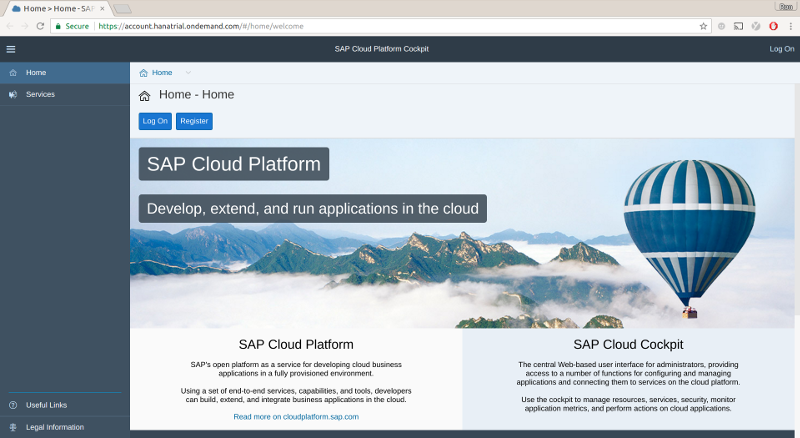
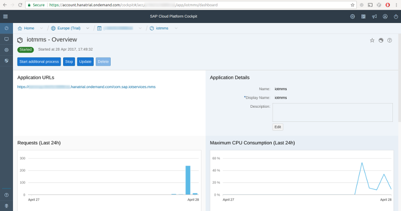
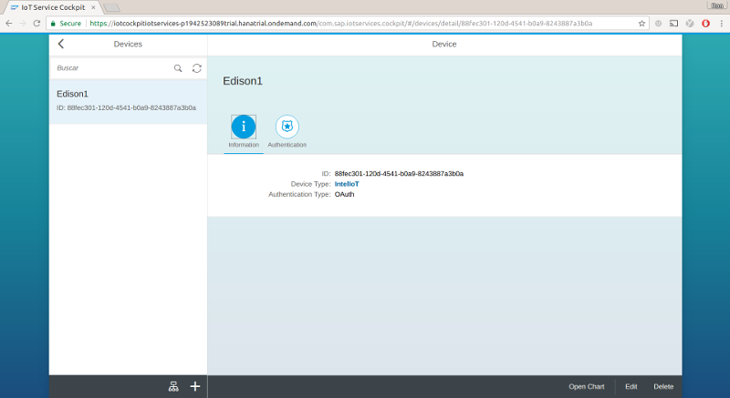
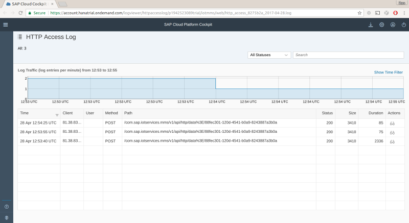

# Connecting to SAP\* Cloud Platform Internet of Things

To get started using the SAP\* IoT Starter Kit, you must first setup your account, by following the "Getting Started in the Cloud" steps listed at https://github.com/SAP/iot-starterkit#getting-started-in-the-cloud

## SAP\* Cloud Platform Developer signup



First, signup for an SAP Cloud Platform Developer account. If you already have an account, you can skip to the next step.

Otherwise following the instructions at:
[https://github.com/SAP/iot-starterkit/tree/master/src/prerequisites/account](https://github.com/SAP/iot-starterkit/tree/master/src/prerequisites/account)

## SAP\* IoT setup

1. Login to SAP

Login to your SAP Cloud Platform Cockpit at [https://account.hanatrial.ondemand.com](https://account.hanatrial.ondemand.com)

2. Enable Internet of Things

Next, enable the "Internet of Things" in your SAP Cloud Platform Cockpit.

Follow the instructions at:
[https://github.com/SAP/iot-starterkit/tree/master/src/prerequisites/service](https://github.com/SAP/iot-starterkit/tree/master/src/prerequisites/service)

3. Create Device Information in Internet of Things Cockpit

To complete the needed prerequisites, you need to follow the following 3 steps:
   - Create a Message Type
   - Create a Device Type
   - Create a Device, and copy the generated Device Token. This is will be needed later to connect the Device.

Follow the instructions at:
[https://github.com/SAP/iot-starterkit/tree/master/src/prerequisites/cockpit](https://github.com/SAP/iot-starterkit/tree/master/src/prerequisites/cockpit)

3. Deploy the Message Management Service (MMS)

Once the configuration is defined, the last step is to deploy the Message Management Service. Make sure that you perform role assignment of the `iotmms` application to your user account.

Follow the instructions located at:
[https://github.com/SAP/iot-starterkit/src/prerequisites/mms](https://github.com/SAP/iot-starterkit/tree/master/src/prerequisites/mms)

## Summary

If you have followed all the steps above, you should have all the information that your program needs to connect to the SAP\* Cloud Platform Internet of Things:



`application_url` - The MMS endpoint application for your account. Located on the Java Application Dashboard of your account for the SAP\* Cloud Platform cockpit.



`device_id` - The device ID for the device you want to connect. Located on the Internet of Things Service Cockpit "Devices" page.

`oauth_token` - OAuth token for the device. This is the generated Device Token from the original setup. You can regenerate the token if needed on the Internet of Things Service Cockpit "Devices" page, using the "Authentication" tab for the device.


`message_type_id` - OutboundMessage Type ID. Located on the Internet of Things Service Cockpit "Message Types" page.

## Additional setup for C++

When running your C++ code on the Intel® Edison board or Intel® IoT Gateway, you will need to use the RESTful client interface by setting the correct parameters in Eclipse\*. To do that:

1. Go to **Run configurations** and, in the **Commands to execute before application** field, type the following:

        export SAP_MMS_ENDPOINT="[application_url]/v1/api/http/data"; export SAP_DEVICE_ID="[device_id]"; export SAP_MESSAGE_TYPE_ID="[message_type_id]"; export SAP_OAUTH_TOKEN="[oauth_token]"

2. Click the **Apply** button to save these settings.
3. Click the **Run** button to run the code on your board.

## Additional setup for JavaScript\*

When running your JavaScript\* code on the Intel® Edison board or Intel® IoT Gateway, you need to use the REST interface, by setting the client parameters in the Intel® XDK IDE. Add the following entries to the **config.json** file:

```json
   "services": {
     "sap": {
       "mms_endpoint": "[application_url]/v1/api/http/data",
       "device_id": "[device id]",
       "message_type_id": "[OutboundMessage Type Id]",
       "oauth_token": "[oauth token]"
    }
  }
```

## Additional setup for Python\*

When running your Python\* code on the Intel® Edison board or Intel® IoT Gateway, you need to use the REST interface, by setting the client parameters. Add the following entries to the **config.json** file:

```json
   "services": {
     "sap": {
       "mms_endpoint": "[application_url]/v1/api/http/data",
       "device_id": "[device id]",
       "message_type_id": "[OutboundMessage Type Id]",
       "oauth_token": "[oauth token]"
    }
  }
```

## Viewing data for debugging

You can monitor the state of the Message Management Service application deployed in the Java Application Dashboard of your account for the SAP\* Cloud Platform cockpit.


1. Login to your SAP Cloud Platform Cockpit at [https://account.hanatrial.ondemand.com](https://account.hanatrial.ondemand.com)

2. Click on "Applications", then click on "Java Applications". This will display a new page with the list of Java applications.

3. Click on the name "iotmms" in the list of applications. This will open the "iotmms - Overview" page.

4. Scroll down the page to the section labeled "Most Recent Logging". Click on the eyeglasses icon next to the "HTTP Access Logs" log you want to view, and the most recent data should be displayed in a new tab.


